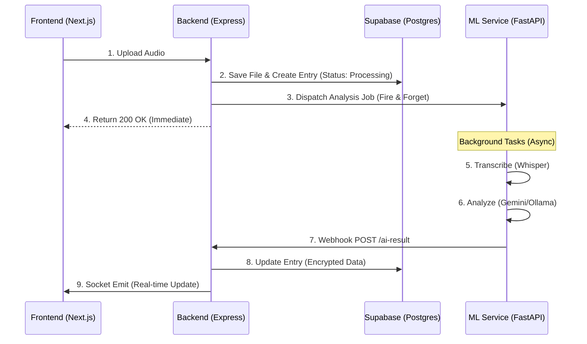

# RESONATE


Your private, AI-powered voice diary -> record, reflect, and rediscover yourself through sound.

## 📖 Overview

Resonate is a full-stack web application designed to be a modern, intelligent journaling experience. Users can record audio diary entries which are transcribed and analyzed by a Hybrid AI Engine. The application leverages a microservice-inspired architecture where a Node.js backend handles business logic and a detached Python FastAPI service handles heavy ML computation asynchronously.

The system is built for flexibility, supporting both Local LLMs (Gemma 2B, Llama 3) via Ollama for privacy-focused users and Google Gemini for cloud-based, high-speed analysis.

## ✨ Core Features

* **🎙️ Voice Recording:** Intuitive interface to record, preview, and upload audio entries.
* **⚡ Real-Time Architecture:**
    * **Fire-and-Forget Processing:** The user is never blocked waiting for AI. Uploads return immediately while analysis runs in the background using FastAPI's BackgroundTasks and asyncio.
    * **Live Notifications:** Integrated Socket.io pushes real-time updates to the client when analysis completes, updating the UI instantly without page reloads.
* **🧠 Hybrid AI Analysis:**
    * **Flexible Backend:** Seamlessly switch between Local LLMs or Cloud AI just by changing an environment variable.
    * **Adaptive Prompting:**
        * **Gemini:** Uses efficient "One-Shot" prompting to extract all insights in a single call.
        * **Local LLMs:** Uses a "Chain of Thought" strategy (4 separate calls) to ensure smaller models like Gemma 2B maintain high accuracy.
    * **Insights Generated:** Summaries, Mood Scoring, Keyword Tagging, Deep Reflections, and Actionable Suggestions.
* **🎯 Smart Goal Detection:** The AI intelligently identifies potential life goals mentioned in your audio and suggests adding them to your tracker.
* **📊 Analytics Dashboard:** Server-side aggregated visualizations using SQL functions for maximum performance:
    * **Mood Trend Line:** Track emotional changes over time.
    * **Emotion Heatmap:** Calendar view of daily dominant emotions.
    * **Topic Frequency:** Analysis of most discussed themes.
* **🔐 Enterprise-Grade Security:**
    * **Encryption at Rest:** All sensitive text (transcripts, summaries, reflections) is encrypted at the application layer before storage.
    * **Row Level Security (RLS):** Supabase policies ensure strict data isolation between users—users can only access their own data.
* **🚀 Performance:**
    * **TanStack Query:** All API calls utilize useQuery and useMutation for aggressive caching, optimistic updates, and background re-fetching.
    * **Server-Side Aggregation:** Heavy analytics calculations are offloaded to Postgres functions via schema_logic.sql, keeping the API lightweight.

## 🏗️ Technical Architecture

Resonate uses an Event-Driven, Asynchronous Architecture to handle heavy AI workloads without compromising user experience.



## Folder Structure

```text
Resonate
├── LICENSE
├── README.md
├── resonate-backend
│   ├── Backend-ML              # Python FastAPI Service
│   │   ├── main.py             # Entry point & Endpoints
│   │   ├── requirements.txt
│   │   └── utils
│   │       ├── ai_service.py   # LLM Logic (Gemini/Ollama)
│   │       └── helperFunction.py
│   └── Backend-Node            # Node.js Express Service
│       ├── controllers/        # Business Logic
│       │   ├── entryController.js
│       │   ├── goalController.js
│       │   ├── insightController.js
│       │   ├── quoteController.js
│       │   └── webhookController.js
│       ├── routes/             # API Routes
│       │   ├── entryRoutes.js
│       │   ├── goalRoutes.js
│       │   ├── insightRoutes.js
│       │   ├── quoteRoutes.js
│       │   └── webhookRoutes.js
│       ├── server.js
│       └── utils
│           ├── config.js
│           └── encryption.js   # AES Encryption Logic
├── resonate-frontend           # Next.js Application
│   ├── src
│   │   ├── app                 # App Router
│   │   ├── components          # Shadcn UI & Custom Components
│   │   ├── hooks               # Custom React Query Hooks
│   │   ├── lib                 # Utilities & Socket Client
│   │   └── ...
└── schema_logic.sql            # Database Triggers & Functions

```

## 🛠️ Database Logic & Automation

Resonate moves critical logic closer to the data for performance and integrity. The `schema_logic.sql` file defines:

* **Automated Cleanup Triggers:**
* `delete_file_when_entry_deleted`: If a DiaryEntry row is removed, a Postgres Trigger automatically deletes the associated audio file from Supabase Storage. This prevents "orphan files" and manages storage costs automatically.


* **Server-Side Analytics (`get_insights`):**
* Instead of fetching thousands of rows to Node.js to calculate averages, we call a single SQL RPC function.
* It computes Heatmaps, Mood Charts, and Topic frequencies directly within the Postgres engine and returns a single, pre-calculated JSON object.


## 🚀 Getting Started

### Prerequisites

* Bun (v1.0+)
* Python (v3.10+)
* Supabase Project
* Clerk Account
* Ollama (Optional, for local AI)

### 1. Environment Setup

Clone the repo and configure environment variables. Refer to `.env.example`

```bash
git clone https://github.com/CodeDevvv/Resonate.git
cd resonate

```

### 2. Database Setup

1. Go to your Supabase SQL Editor.
2. Run the contents of `schema_logic.sql`. This creates the Tables, Enums, Triggers, and Analytics Functions required for the app to function.

### 3. AI Model Setup (Choose One)

**Option A: Cloud (Google Gemini)**

1. Get an API Key from Google AI Studio.
2. Add `GEMINI_API_KEY` to `Backend-ML/.env`.
3. Set `AI_MODEL=gemini` in `.env`.

**Option B: Local (Ollama)**

1. Install Ollama.
2. Pull the models used by the system:
```bash
ollama run gemma:2b
ollama run llama3.2:3b

```


3. Set `AI_MODEL=local` in `.env`.

### 4. Run the Application

**Step 1: Start ML Backend (Python)**
Handles Transcription & Intelligence.

```bash
cd resonate-backend/Backend-ML
pip install -r requirements.txt
uvicorn main:app --reload --port 8000

```

**Step 2: Start API Backend (Node.js)**
Handles Database, Auth, and Webhooks.

```bash
cd resonate-backend/Backend-Node
bun install
bun run server

```

**Step 3: Start Frontend (Next.js)**
The User Interface.

```bash
cd resonate-frontend
bun install
bun run dev

```

Visit `http://localhost:3000` to start recording.

## 🧩 Feature to Tech Mapping

| Feature | Tech Stack |
| --- | --- |
| **Frontend Caching** | TanStack Query (Stale-while-revalidate strategy) |
| **Real-time Status** | Socket.io (Event-driven updates) |
| **DB & Storage** | Supabase (PostgreSQL + Triggers) |
| **Transcription** | OpenAI Whisper (Ran locally via Python) |
| **LLM Orchestration** | FastAPI (Background Tasks) |
| **Analytics** | PL/pgSQL (Stored Procedures) |

## 📜 License

This project is licensed under the MIT License. See the LICENSE file for the full text.